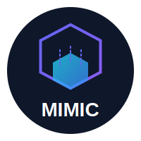

<div align="center">
  
  <h1>Mimic-Kit</h1>
  <p><strong>让黑盒知识蒸馏变得简单</strong></p>

  [](https://www.python.org/downloads/)
  [](LICENSE)
</div>

---

**中文** | [English](README.md)

Mimic-Kit 是一个**黑盒知识蒸馏脚手架**，帮助你将强大教师模型的能力蒸馏到更小、更高效的学生模型中。

## 特性

- 🤖 **教师模型生成**: 使用 OpenAI API（或兼容 API）生成高质量训练数据
- 🚀 **高效训练**: 基于 [ms-swift](https://github.com/modelscope/swift) 构建，训练流程简洁高效
- 🧩 **灵活微调**: 支持 LoRA（参数高效）和全参数微调
- ⚡ **性能优化**: 集成 DeepSpeed 和 Liger Kernel 加速训练
- 💾 **智能缓存**: 自动缓存 API 响应，节省调用成本
- 📊 **多数据格式**: 支持对话和文本补全两种格式

## 快速开始

### 1. 安装

**方式一：从 PyPI 安装（推荐）**

```bash
pip install mimic-kit
```

**方式二：从源码安装**

```bash
# 克隆仓库
git clone https://github.com/ECNU-innoSpark/EduRmDistill
cd mimic-kit

# 使用 UV 安装依赖
uv sync

# 或包含开发依赖
uv sync --group dev
```

### 2. 初始化配置

```bash
uv run mimic init
```

这将创建一个 `config.yaml` 模板。编辑它配置教师模型、学生模型和训练参数。

### 3. 准备数据

创建包含提示词的 JSONL 文件，支持两种格式：

**对话格式：**
```jsonl
{"messages": [{"role": "user", "content": "解释 Python 装饰器"}]}
{"messages": [{"role": "user", "content": "如何反转链表？"}]}
```

**文本补全格式：**
```jsonl
{"text": "Python 装饰器是一个强大的特性..."}
{"text": "要反转链表，你需要..."}
```

### 4. 生成训练数据

```bash
uv run mimic generate
```

这将把你的提示词发送给教师模型，并将生成的回复保存为训练数据。

### 5. 训练学生模型

```bash
uv run mimic train
```

学生模型将使用生成数据按照配置的方法（LoRA 或全参数微调）进行微调。

## 配置示例

```yaml
# 数据配置
data:
  input_path: "./data/prompts.jsonl"
  dataset_path: "./data/distilled_data.jsonl"
  system_prompt: "你是一个有帮助的助手。"

# 教师模型（黑盒 API）
teacher:
  provider: "openai"
  model: "gpt-4o"
  api_key: "sk-..."
  base_url: "https://api.openai.com/v1"
  generation_params:
    temperature: 0.7
    max_tokens: 2048

# 学生模型（开源大模型）
student:
  base_model: "Qwen/Qwen2.5-1.5B-Instruct"
  tuner_type: "lora"  # 或 "full" 全参数微调
  lora_config:
    rank: 8
    alpha: 32

# 训练配置
training:
  epochs: 3
  per_device_train_batch_size: 4
  learning_rate:
    initial: 1e-4
  saving:
    output_dir: "./outputs"
```

详见 `config.yaml` 中的所有选项。

## 项目结构

```
mimic-kit/
├── mimic/
│   ├── cli.py              # CLI 入口
│   ├── config.py           # 配置模型 (Pydantic v2)
│   ├── generator/          # 教师模型数据生成
│   └── trainer/            # 学生模型训练 (ms-swift)
├── data/                   # 训练数据目录
├── config.yaml             # 你的配置文件
└── output/                 # 模型输出和检查点
```

## CLI 命令

| 命令 | 说明 |
|------|------|
| `mimic init` | 创建 `config.yaml` 模板 |
| `mimic generate` | 使用教师模型生成训练数据 |
| `mimic train` | 使用 ms-swift 训练学生模型 |

## 环境要求

- Python 3.13+
- CUDA 支持 GPU（用于训练）
- OpenAI API 密钥（或兼容 API）

## 开发

```bash
# 安装开发依赖
uv sync --group dev

# 格式化代码
uv run ruff format .

# 检查代码规范
uv run ruff check . --fix

# 类型检查
uv run mypy mimic/
```

## 许可证

MIT 许可证 - 详见 [LICENSE](LICENSE) 文件。

## 致谢

- 使用 [ms-swift](https://github.com/modelscope/swift) 进行模型训练
- 使用 [Pydantic](https://docs.pydantic.dev/) 进行配置验证
- 使用 [Click](https://click.palletsprojects.com/) 构建 CLI
